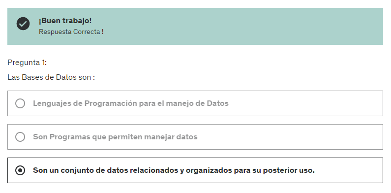
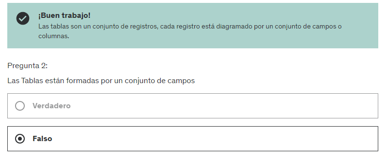
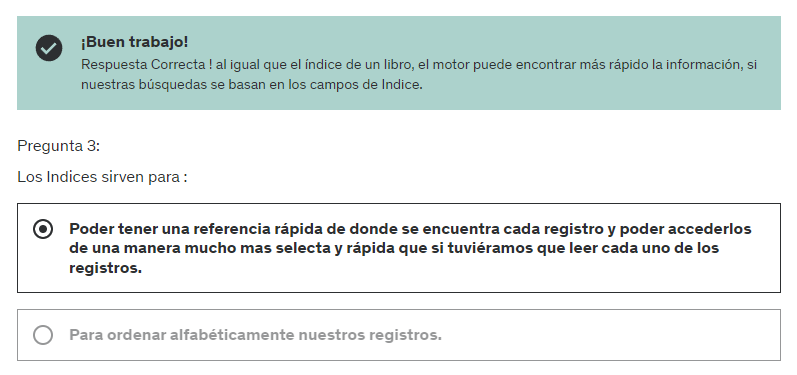

# 1. CONCEPTOS DE BASES DE DATOS

**DEFINICION:** Una base de datos es una colección organizada de datos que se almacenan y gestionan para facilitar su acceso, manipulación y actualización.

**COMPONENTES PRINCIPALES:** 

- **Datos:** Información organizada en tablas, registros y campos.
- **Sistema de gestión de bases de datos (DBMS):** Software que permite interactuar con la base de datos. Ejemplos populares incluyen MySQL, PostgreSQL, Oracle, y Microsoft SQL Server.
- **Lenguaje de consulta estructurado (SQL):** Lenguaje estándar utilizado para interactuar con bases de datos relacionales.

**TIPOS DE BASES DE DATOS:**

- **Relacionales:** Organizan datos en tablas con relaciones definidas entre ellas. Ejemplo: MySQL.
- **NoSQL:** No utilizan esquemas de tablas tradicionales y son útiles para datos no estructurados. Ejemplo: MongoDB.
- **Orientadas a objetos:** Manejan datos como objetos, similar a la programación orientada a objetos. Ejemplo: db4o.
- **Distribuidas:** Los datos se distribuyen en diferentes ubicaciones físicas, pero se manejan como una sola base de datos. Ejemplo: Apache Cassandra.

**Bases de datos relacionales**

- Estructura: Los datos se almacenan en tablas, con filas y columnas. Cada tabla tiene un esquema fijo que define qué tipos de datos puede contener (por ejemplo, números, textos, fechas).
- Relaciones: Las tablas pueden estar relacionadas entre sí mediante claves externas. Esto permite la normalización, que es la división de datos en múltiples tablas para reducir la redundancia.
- SQL (Structured Query Language): Se utiliza un lenguaje de consulta estandarizado (SQL) para realizar operaciones como insertar, actualizar, eliminar y consultar datos.
- Consistencia: Son ideales para aplicaciones que requieren transacciones complejas y consistencia de datos.

**Bases de datos NoSQL**

- Estructura flexible: No siguen un esquema fijo. Los datos pueden almacenarse en varios formatos como documentos, grafos, claves-valor o columnas.
- Escalabilidad horizontal: Suelen ser más fáciles de escalar horizontalmente, lo que significa que se pueden añadir más servidores para manejar más datos o tráfico.
- Desempeño y flexibilidad: Son ideales para manejar grandes volúmenes de datos no estructurados o semi-estructurados y pueden ofrecer un alto rendimiento para ciertas operaciones.
- Tipos de modelos de datos:

    1. Documentos: JSON, BSON, XML (ej. MongoDB)
    2. Grafos: Datos que muestran relaciones complejas (ej. Neo4j)
    3. Clave-valor: Pares clave-valor simples (ej. Redis)
    4. Columnas: Almacenan datos en columnas en lugar de filas (ej. Cassandra)

# 2. CONCEPTO DE MOTORES DE BASES DE DATOS

Un motor de base de datos es un software que se encarga de administrar y gestionar el acceso a los datos almacenados en una base de datos.

Los motores de bases de datos pueden clasificarse en dos tipos principales:

Bases de datos relacionales: estos motores de base de datos utilizan el modelo de datos relacional, que se basa en tablas con filas y columnas para almacenar los datos. Ejemplos de motores de bases de datos relacionales son MySQL, PostgreSQL, Oracle, SQL Server, SQLite, entre otros.

Bases de datos no relacionales: estos motores de base de datos utilizan modelos de datos no relacionales, como el modelo de documentos, el modelo clave-valor o el modelo de grafos, para almacenar los datos. Ejemplos de motores de bases de datos no relacionales son MongoDB, DynameDB, Redis, Cassandra, Neo4j, entre otros.

# 3. CONCEPTO DE TABLAS
Una tabla es una estructura de datos que se utiliza para almacenar información en forma de filas y columnas. Cada tabla está diseñada para contener información sobre un conjunto específico de objetos o entidades, y cada fila de la tabla representa una instancia o registro de esa entidad.

# 4. CONCEPTOS DE CAMPOS
En una base de datos, un campo es la unidad básica de información que se almacena en una tabla. Los campos representan las diferentes propiedades o atributos de una entidad, como el nombre, la dirección, la fecha de nacimiento, el género, etc.

Cada campo se representa por una columna en la tabla, y cada fila de la tabla representa una instancia de la entidad con sus respectivos valores de campo. Por ejemplo, si tenemos una tabla de "Clientes", cada fila de la tabla representará a un cliente diferente, y las columnas de la tabla representarán sus atributos o campos, como el nombre, la dirección, el número de teléfono, el correo electrónico, etc.

Cada campo en una base de datos tiene un tipo de datos asociado, que define el tipo de valor que se puede almacenar en ese campo, como números, fechas, cadenas de texto, etc. Además, cada campo puede tener restricciones de integridad para garantizar que los datos almacenados sean válidos y consistentes. Por ejemplo, se pueden establecer restricciones para asegurar que un campo no pueda estar vacío, o que un campo solo pueda contener valores únicos.

# 5. CONCEPTO DE TIPOS DE DATOS DE LOS CAMPOS

En MySQL, los tipos de datos de los campos determinan qué tipo de valores pueden almacenar las columnas de una tabla. Estos tipos de datos ayudan a optimizar el almacenamiento, asegurar la integridad de los datos y mejorar el rendimiento de las consultas. MySQL ofrece una amplia variedad de tipos de datos, que se pueden clasificar en varias categorías principales: numéricos, de cadena (carácter), fecha y hora, y binarios.

### Tipos de datos numéricos

**1. Enteros:**

- TINYINT: Almacena números enteros de 1 byte. Rango: -128 a 127 (sin signo) o 0 a 255 (con signo).
- SMALLINT: Almacena números enteros de 2 bytes. Rango: -32,768 a 32,767 (sin signo) o 0 a 65,535 (con signo).
- MEDIUMINT: Almacena números enteros de 3 bytes. Rango: -8,388,608 a 8,388,607 (sin signo) o 0 a 16,777,215 (con signo).
- INT o INTEGER: Almacena números enteros de 4 bytes. Rango: -2,147,483,648 a 2,147,483,647 (sin signo) o 0 a 4,294,967,295 (con signo).
- BIGINT: Almacena números enteros de 8 bytes. Rango: -9,223,372,036,854,775,808 a 9,223,372,036,854,775,807 (sin signo) o 0 a 18,446,744,073,709,551,615 (con signo).

Los números enteros pueden ser sin signo (UNSIGNED), lo que duplica el rango de valores positivos permitidos al no permitir valores negativos.

**2. Decimales y de punto flotante:**

- FLOAT: Almacena números de punto flotante de precisión simple. Útil para números con precisión decimal que no requieren exactitud extrema.
- DOUBLE: Almacena números de punto flotante de doble precisión. Más precisión que FLOAT.
- DECIMAL: Almacena números con precisión fija. Se define con una precisión (M) y escala (D), es decir, el número total de dígitos y los dígitos después del punto decimal. Es útil para valores exactos como precios o cantidades monetarias.

### Tipos de datos de cadena (carácter)

- CHAR: Almacena una cadena de longitud fija. Por ejemplo, CHAR(10) siempre almacenará 10 caracteres, rellenando con espacios si es necesario. Es eficiente para almacenar valores que tienen una longitud uniforme.

- VARCHAR: Almacena una cadena de longitud variable. Por ejemplo, VARCHAR(255) puede almacenar hasta 255 caracteres, pero solo usa el espacio necesario para los datos almacenados más un byte para la longitud (o dos bytes si la longitud máxima es mayor a 255).

- TEXT: Utilizado para almacenar grandes cantidades de texto. Existen variantes como TINYTEXT, TEXT, MEDIUMTEXT y LONGTEXT, que difieren en la cantidad máxima de datos que pueden almacenar.

- BLOB: Similar a TEXT, pero para datos binarios. Las variantes incluyen TINYBLOB, BLOB, MEDIUMBLOB y LONGBLOB. Se utiliza para almacenar datos binarios como imágenes o archivos.

- ENUM: Almacena una lista de valores predefinidos. Por ejemplo, ENUM('small', 'medium', 'large') solo permite almacenar esos tres valores. Es útil para datos que solo pueden tomar ciertos valores predefinidos.

- SET: Similar a ENUM, pero permite almacenar múltiples valores de una lista predefinida. Por ejemplo, SET('A', 'B', 'C') puede almacenar combinaciones de estos valores, como 'A,B'.

### Tipos de datos de fecha y hora

- DATE: Almacena una fecha en formato YYYY-MM-DD.
- TIME: Almacena una hora en formato HH:MM:SS.
- DATETIME: Almacena una fecha y hora en formato YYYY-MM-DD HH:MM:SS.
- TIMESTAMP: Similar a DATETIME, pero también almacena la zona horaria y se puede utilizar para registrar la última actualización de un registro automáticamente.
- YEAR: Almacena un año en formato YYYY.

### Tipos de datos binarios

- BINARY: Almacena una cadena de longitud fija de bytes. Similar a CHAR, pero para datos binarios.
- VARBINARY: Almacena una cadena de longitud variable de bytes. Similar a VARCHAR, pero para datos binarios.


# 6. CONCEPTO DE INDICES
Los índices son estructuras de datos que se utilizan para mejorar la eficiencia de las consultas y operaciones en una base de datos, permitiendo acceder rápidamente a los registros que cumplen con ciertas condiciones. Los índices se crean en una o varias columnas de una tabla y pueden ser útiles en grandes bases de datos, pero deben ser utilizados con cuidado.

**TIPOS DE INDICES**

**Clave primaria (Primary Key)**: La primary key (clave primaria) es un conjunto de uno o más campos/columnas en una tabla que se utilizan para identificar de manera única cada fila en esa tabla. Cada tabla puede tener solo una clave primaria, y ninguno de los campos que forman la clave primaria puede tener valores nulos.

Ejemplo:
Imagina una tabla que almacena información de estudiantes. Cada estudiante tiene un identificador único (student_id), que podría ser la clave primaria.

```mysql
CREATE TABLE Students (
    student_id INT NOT NULL,
    name VARCHAR(100),
    email VARCHAR(100),
    PRIMARY KEY (student_id)
);
```

En este caso, student_id es la primary key, lo que asegura que no habrá dos estudiantes con el mismo student_id.

**Clave única (Unique Key)**: La unique key (clave única) garantiza que todos los valores en una columna o un conjunto de columnas sean distintos, es decir, no se puedan repetir. A diferencia de la primary key, una tabla puede tener múltiples unique keys, y es posible tener valores nulos (a menos que se especifique lo contrario).

Ejemplo:
Supongamos que en la misma tabla de estudiantes, queremos asegurarnos de que los emails también sean únicos, pero sabemos que no todos los estudiantes proporcionarán un email. Podríamos hacer que email sea una unique key.

```mysql
CREATE TABLE Students (
    student_id INT NOT NULL,
    name VARCHAR(100),
    email VARCHAR(100) UNIQUE,
    PRIMARY KEY (student_id)
);
```

Aquí, aunque email es una unique key y debe ser único para los estudiantes que proporcionan uno, puede contener valores nulos.

**Clave (Key)**: Un índice en MySQL se utiliza para acelerar las consultas de búsqueda/consulta en la base de datos. No impone ninguna restricción de unicidad por sí mismo (a menos que se especifique como UNIQUE INDEX). Los índices se pueden aplicar a una o más columnas.

Ejemplo:
Si en la tabla de estudiantes, frecuentemente buscamos estudiantes por su nombre, podemos crear un índice en la columna name para hacer estas consultas más rápidas.

```mysql
CREATE TABLE Students (
    student_id INT NOT NULL,
    name VARCHAR(100),
    email VARCHAR(100),
    PRIMARY KEY (student_id),
    INDEX (name)
);
```

En este ejemplo, añadir un índice a name ayuda a mejorar el rendimiento de las consultas que buscan por nombre, aunque más de un estudiante puede tener el mismo nombre.

En resumen, utiliza:

- Primary Key para identificar de manera única cada fila en una tabla.
- Unique Key para asegurar que no se repitan valores en una columna o conjunto de columnas, admitiendo nulos.
- Key (Index) para mejorar el rendimiento de las consultas en columnas específicas.

# CUESTIONARIO 1: EXAMEN BASICO DE LOS COMCEPTOS DE BASES DE DATOS





