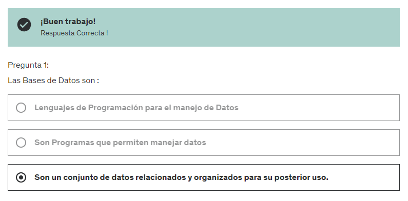
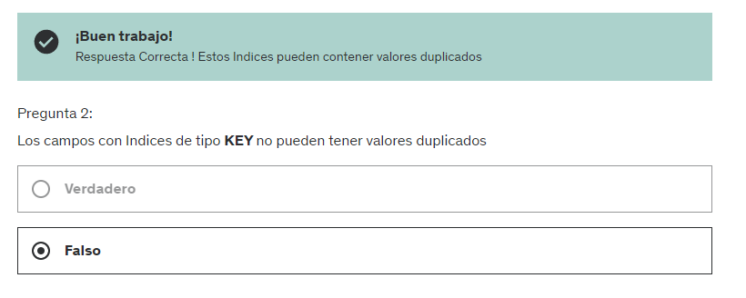

# 7. QUE ES MYSQL 

MySQL es un sistema de gestión de bases de datos relacionales (RDBMS) muy popular y ampliamente utilizado. Fue desarrollado originalmente por MySQL AB, que fue adquirida por Sun Microsystems y posteriormente por Oracle Corporation. MySQL es un software libre y de código abierto, lo que significa que se puede descargar, utilizar y modificar de forma gratuita.

# 8. ACLARACIONES SOBRE LA INSTALACION DE MYSQL

Debido a la enorme cantidad de variantes y opciones de paquetes de instalación, como de equipos y configuraciones. la instalación de MySQL podría suponer dificultades y errores.

Es por eso que en el siguiente capítulo, aprenderán a instalar MySQL desde la página de ORACLE (empresa proveedora de MySQL)

He tomado la determinación de no dar mas soporte relacionado a la Instalación y problemas relacionados., porque de 100 consultas que recibo, 90 están relacionadas a este tema y sinceramente, no puedo hacerme cargo de las fallas técnicas o de software o de incompatibilidad entre el software y el equipo del alumno.

Muchas veces he tenido que GOOGLEAR para encontrar la solución para el alumno, algo que el mismo alumno podría hacer.

Voy a dar todo el soporte necesario para responder dudas sobre :

- El curso y los ejercicios
- Términos o conceptos de Bases de Datos
- El Lenguaje SQL
- HeidiSQL y sus opciones
- Cualquier tema académico incluido en el mismo.

NO daré soporte sobre :

- Instalación de MySQL
- Ejercicios creados por los usuarios y que no tienen relación a los mostrados en el curso
- Proyectos personales o revisión de trabajos realizados

He tenido que tomar esta decisión, porque con mas de 45.000 alumnos, ya no poseo el tiempo para tantas consultas que no se relacionan con el programa de enseñanza del curso.
Espero sepan comprender la situación
Muchas Gracias

Pablo Tilotta

# 9. INSTALANDO MYSQL EN MI PC

https://dev.mysql.com/get/Downloads/MySQLInstaller/mysql-installer-community-8.0.39.0.msi

# 10. INSTALANDO HEIDISQL EN MI PC
# 11. NOS CONECTAMOS AL MOTOR Y CREAMOS LA PRIMERA BASE DE DATOS

# 12. DESCARGAR ARCHIVOS .SQL DE EJEMPLO

Descarguen el archivo que les adjunto en esta clase, que será lo que usaremos para todos los ejercicios del resto del curso

# 13. IMPORTAMOS EL ARCHIVO SQL DEL CURSO
# 14. HERRAMIENTAS ADICIONALES DE HEIDISQL

# CUESTIONARIO 2: EXAMEN PARA LA SECCION DE MYSQL

