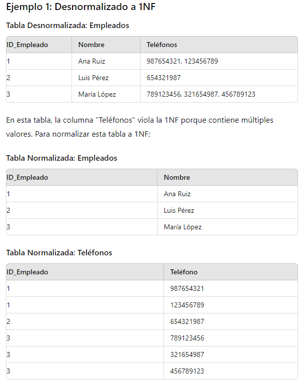
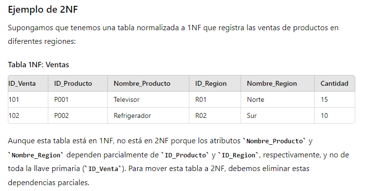
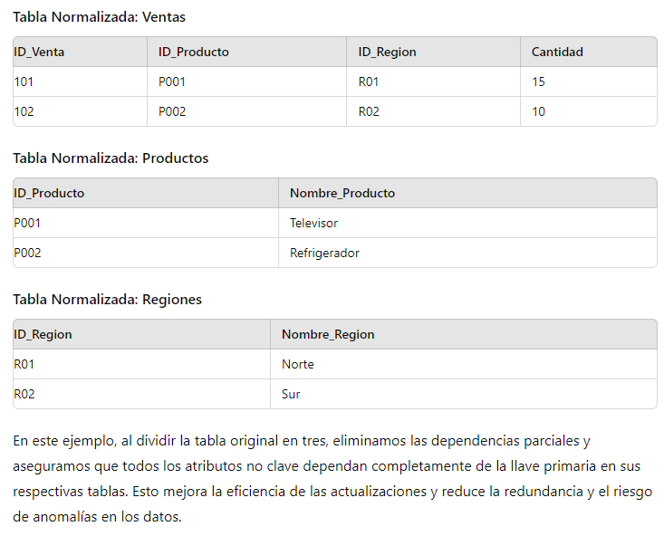
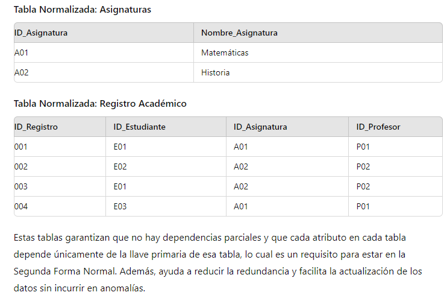
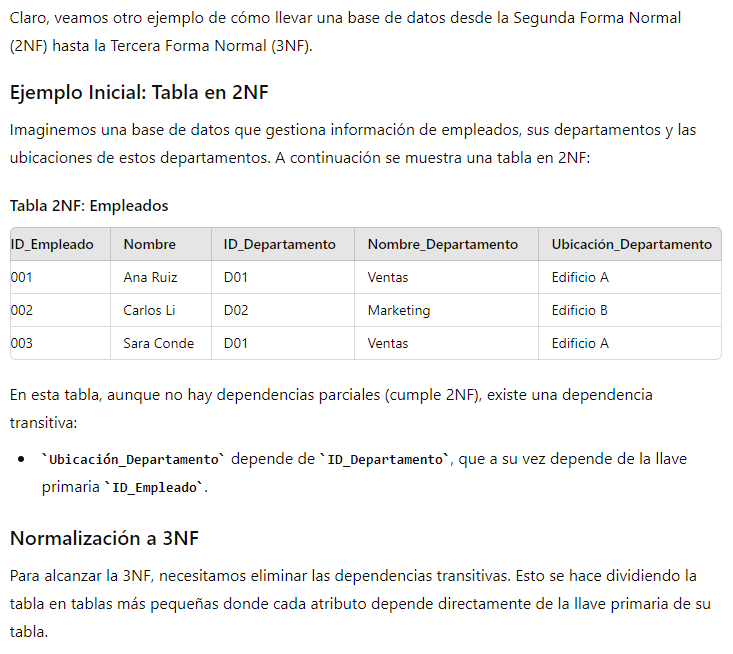
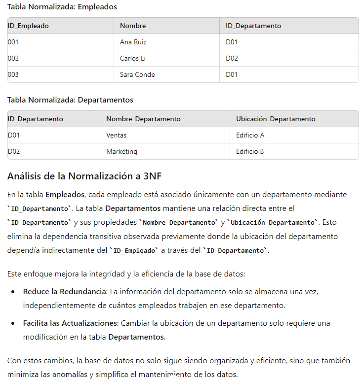
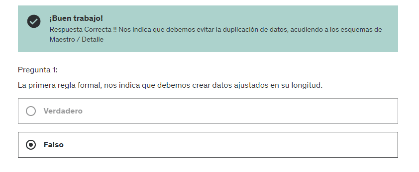
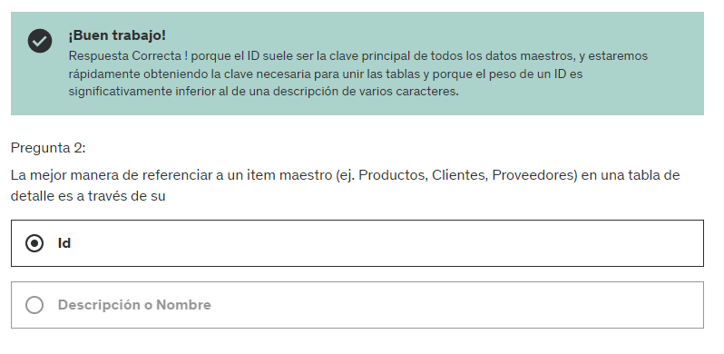

# SECCION 3: NORMALIZACIONES DE BASES DE DATOS (2023)

# 15. La primera Forma Normal

La Primera Forma Normal (1NF) es el primer nivel de normalización en bases de datos relacionales, y su cumplimiento es fundamental para garantizar la estructura adecuada de una base de datos. Una tabla está en la primera forma normal cuando cumple con las siguientes condiciones:

- *Atomicidad:* Todos los valores en las columnas deben ser atómicos, es decir, indivisibles. Cada columna debe contener un valor único y no un conjunto de valores o una lista. Por ejemplo, en lugar de tener una columna que almacene varios números de teléfono, cada número de teléfono debería estar en su propia fila o en una tabla separada.

- *Sin Grupos Repetitivos:* No debe haber grupos de columnas que se repitan. Esto se refiere a la necesidad de evitar el almacenamiento múltiple de la misma combinación de datos en varias filas, lo que puede ser manejado mejor mediante una tabla separada.

- *Identificador Único (Llave Primaria):* Cada fila en la tabla debe ser identificable de forma única mediante una llave primaria. Esto asegura que cada registro pueda ser recuperado, actualizado o eliminado de manera precisa sin afectar a otros registros.

El objetivo principal de aplicar la primera forma normal es reducir la redundancia y mejorar la integridad de los datos en la base de datos. Al seguir estas reglas, se facilita la manipulación de los datos y se evitan anomalías en las operaciones de inserción, eliminación y actualización.

# 16. La segunda forma normal

La Segunda Forma Normal (2NF) es un nivel adicional de normalización en bases de datos relacionales que se aplica después de alcanzar la Primera Forma Normal (1NF). La 2NF se enfoca en la relación entre la llave primaria y los atributos no clave de una tabla. Para que una tabla esté en 2NF, debe cumplir con dos criterios:

- *Ya estar en 1NF:* Esto implica que todos los atributos deben ser atómicos y no debe haber grupos repetitivos de columnas.

- *Dependencia Total:* Todos los atributos no clave deben depender completamente de la llave primaria. Esto significa que si una tabla tiene una llave primaria compuesta (formada por más de un atributo), cada atributo no clave debe depender de todos los componentes de la llave para asegurar la integridad de los datos.

Ejemplo Inicial: Tabla en 1NF
Supongamos que tenemos una tabla de registros de estudiantes y las asignaturas que cursan, junto con la información del profesor de cada asignatura.

# 17. La tercera forma normal

La Tercera Forma Normal (3NF) es otro nivel de normalización en bases de datos relacionales que se enfoca en reducir la redundancia de datos eliminando las dependencias transitivas entre columnas. Para que una tabla esté en la 3NF, debe cumplir con los siguientes criterios:

- *Ya estar en 2NF:* Esto significa que la tabla ya debe estar en la Segunda Forma Normal, es decir, todos los atributos no clave deben depender completamente de la llave primaria y no debe haber dependencias parciales.

- *Sin Dependencias Transitivas:* Un atributo no clave no debe depender de otro atributo no clave. En otras palabras, los atributos no clave deben depender directamente de la llave primaria, y no a través de otro atributo no clave.

# 18. Buenas practicas - mas tablas - menos columnas

El concepto de "Buenas prácticas: más tablas, menos columnas" en el diseño de bases de datos se refiere a la estrategia de normalización para mejorar la estructura de la base de datos, aumentar su eficiencia y facilitar su mantenimiento. Esta práctica promueve la creación de múltiples tablas especializadas en lugar de unas pocas tablas con muchas columnas. Vamos a desglosar este concepto y explorar sus beneficios y ejemplos:

1. Reducción de la Redundancia: Separar los datos en varias tablas ayuda a eliminar la redundancia de datos, lo cual es crucial para minimizar el espacio de almacenamiento y evitar inconsistencias durante las actualizaciones de datos.

2. Mejora de la Integridad de Datos: Al utilizar claves foráneas y tablas especializadas, se fortalece la integridad referencial, asegurando que las relaciones entre tablas se mantengan correctamente y que los datos sean consistentes.

3. Facilidad de Mantenimiento: Es más fácil y menos costoso modificar una estructura de base de datos cuando está dividida en tablas más pequeñas y manejables.

4. Eficiencia en Consultas: Las bases de datos bien normalizadas pueden mejorar el rendimiento de las consultas al reducir la cantidad de datos que necesitan ser escaneados en operaciones de búsqueda, actualización o eliminación.

*Ejemplo: Sistema de Gestión de Empleados*

*Antes (Menos tablas, más columnas):*

- Una sola tabla Empleados con las columnas: ID_Empleado, Nombre, ID_Departamento, Nombre_Departamento, Ubicación_Departamento, Rol, Fecha_Contratación.

*Después (Más tablas, menos columnas):*

- Empleados: ID_Empleado, Nombre, ID_Departamento, ID_Rol, Fecha_Contratación.
- Departamentos: ID_Departamento, Nombre_Departamento, Ubicación_Departamento.
- Roles: ID_Rol, Descripción_Rol.

# 19. Buenas practicas - mas registros - menos columnas

La práctica de "Buenas prácticas: más registros, menos columnas" en el diseño de bases de datos tiene que ver con el enfoque en mantener tablas con estructuras verticales más que horizontales, optimizando de esta manera tanto la eficiencia de las operaciones como la flexibilidad del diseño de la base de datos. Este enfoque tiene múltiples ventajas y aplicaciones prácticas. Veamos en detalle algunos ejemplos.

*Ejemplos*

*Ejemplo 1: Sistema de Control de Versiones de Documentos*

*Antes (Menos registros, más columnas):*

- Una tabla Documentos con columnas para cada revisión: ID_Documento, Titulo, Revisión_1, Fecha_1, Revisión_2, Fecha_2, ..., Revisión_N, Fecha_N.

*Después (Más registros, menos columnas):*

Documentos: ID_Documento, Título.
Revisiones: ID_Revisión, ID_Documento, Número_Revisión, Contenido, Fecha.

*Ejemplo 2: Registro de Eventos de Usuario en una Aplicación*

*Antes:*

- Una tabla EventosUsuario con una columna para cada tipo de evento: ID_Evento, ID_Usuario, Login_Fecha, Logout_Fecha, Compra_Fecha, Compra_Detalle, Error_Fecha, Error_Detalle.
Después:

- Usuarios: ID_Usuario, Nombre, etc.
- Eventos: ID_Evento, ID_Usuario, Tipo_Evento, Fecha, Detalle.

La adopción de "más registros, menos columnas" no solo refleja buenas prácticas en la normalización y estructuración de bases de datos, sino que también proporciona una mayor flexibilidad para adaptar la base de datos a cambios futuros y escalar de acuerdo con las necesidades del negocio. Este enfoque se centra en mantener la base de datos más organizada, optimizada y lista para crecer, aprovechando al máximo las capacidades del sistema de gestión de bases de datos para manejar grandes volúmenes de información de manera eficiente.

# 20. Buenas practicas - usar campos de estado

Las "Buenas prácticas: usar campos de estado" en el diseño de bases de datos se refieren a la incorporación de campos específicos que representen el estado de un registro dentro de un sistema. Estos campos de estado son cruciales para gestionar el flujo de trabajo, las transiciones de estado y el control de accesos, entre otras funcionalidades. Este enfoque facilita la implementación de lógicas complejas de negocio y ayuda a mantener el control y la trazabilidad de los datos. 

*Ejemplo 1: Sistema de Gestión de Pedidos*

*Tabla: Pedidos*

- ID_Pedido
- Fecha_Pedido
- ID_Cliente
- Total
- Estado (Pendiente, Aprobado, Enviado, Entregado)

En este sistema, el campo Estado permite gestionar el flujo del pedido a través de diferentes fases del proceso de compra, y puede desencadenar notificaciones o cambios en la lógica de negocio dependiendo del estado actual.

*Ejemplo 2: Sistema de Tickets de Soporte*

- Tabla: Tickets
- ID_Ticket
- Fecha_Creación
- Descripción
- ID_Usuario
- Estado (Abierto, En Proceso, Resuelto, Cerrado)

El campo Estado en la tabla de tickets ayuda a los agentes de soporte y a los usuarios a seguir el progreso del problema reportado, y a determinar qué acciones son necesarias en cada etapa del proceso de resolución.

*Conclusión*

Utilizar campos de estado en el diseño de bases de datos es una práctica recomendada que aporta estructura, control y eficiencia al manejo de datos. Facilita la implementación de reglas de negocio complejas y mejora la capacidad de la organización para monitorizar, reportar y actuar sobre los datos de manera eficaz. Además, optimiza la interacción entre los usuarios y el sistema, proporcionando claridad y previsibilidad en los procesos que dependen de estados bien definidos.

# 21. Buenas practicas - uso de llaves foraneas

El uso de llaves foráneas en bases de datos es una práctica fundamental en el diseño de bases de datos relacionales y juega un papel crucial en mantener la integridad referencial entre tablas. Las llaves foráneas permiten establecer relaciones claras y lógicas entre los conjuntos de datos, asegurando que las referencias entre ellos sean válidas y coherentes. 

*Ejemplo 1: Sistema de Gestión de Universidad*

*Tabla: Estudiantes*

- ID_Estudiante (PK)
- Nombre
- ID_Carrera (FK)

*Tabla: Carreras*

- ID_Carrera (PK)
- Nombre_Carrera

En este ejemplo, ID_Carrera en la tabla Estudiantes es una llave foránea que referencia a ID_Carrera en la tabla Carreras. Esto asegura que cada estudiante esté inscrito en una carrera que exista.

*Ejemplo 2: Sistema de Gestión de Empleados y Departamentos*

*Tabla: Empleados*

- ID_Empleado (PK)
- Nombre
- ID_Departamento (FK)

*Tabla: Departamentos*

- ID_Departamento (PK)
- Nombre_Departamento

Aquí, ID_Departamento en la tabla Empleados es una llave foránea que hace referencia a ID_Departamento en la tabla Departamentos. Esto vincula cada empleado con un departamento específico y asegura que no se pueda asignar un departamento a un empleado a menos que dicho departamento exista.

*Conclusión*

El uso adecuado de llaves foráneas es indispensable para el diseño eficaz de bases de datos relacionales. Facilita la gestión de la integridad de los datos, mejora la eficiencia operacional y proporciona claridad estructural, lo que resulta en sistemas más robustos y fáciles de mantener. Adoptar esta práctica no solo mejora la calidad de las aplicaciones de base de datos sino que también soporta la escalabilidad y la expansión de los sistemas a medida que evolucionan las necesidades de la organización.

# 22. Buenas practicas - usar valores default

El uso de valores predeterminados (default values) en bases de datos es una práctica común que mejora la eficiencia y la consistencia de los datos. Los valores por defecto se definen en la estructura de la tabla y se aplican automáticamente cuando se inserta un nuevo registro sin que se especifique un valor para ese campo. 

*Ejemplo 1: Sistema de Gestión de Pedidos*

*Tabla: Pedidos*

- ID_Pedido (PK)
- Fecha_Pedido
- Estado (default 'Pendiente')
- Total (default 0.00)

En este sistema, cada nuevo pedido puede ser insertado sin especificar el Estado o el Total. Por defecto, el pedido comenzará con el estado 'Pendiente' y un total de 0.00, lo que facilita la inserción rápida de nuevos pedidos y asegura la consistencia en el tratamiento de los estados iniciales de los pedidos.

*Ejemplo 2: Sistema de Registro de Usuarios*

*Tabla: Usuarios*

- ID_Usuario (PK)
- Nombre
- Fecha_Registro (default CURRENT_TIMESTAMP)
- Activo (default true)

Aquí, cada vez que se crea un nuevo usuario, la fecha de registro se establece automáticamente al momento actual y el usuario se activa por defecto. Esto elimina la necesidad de que los desarrolladores especifiquen estos valores cada vez que se inserta un nuevo usuario, asegurando que todos los registros tengan timestamps consistentes y que el estado inicial de activación sea uniforme.

Conclusión
Utilizar valores predeterminados en las bases de datos no solo optimiza los procesos de inserción y actualización, sino que también refuerza la integridad de los datos al garantizar que los campos esenciales no queden indeterminados. Esta práctica es particularmente útil en entornos empresariales donde la eficiencia y la consistencia de los datos son prioritarias, facilitando la gestión y el mantenimiento a largo plazo de la base de datos.

# 23. Buenas practicas - tablas resumen

Las "Buenas prácticas: tablas resumen" se refieren al diseño y uso de tablas agregadas que almacenan datos precalculados, como totales, promedios, o conteos, que son el resultado de operaciones sobre grandes volúmenes de datos. Estas tablas son especialmente útiles en sistemas donde se requieren respuestas rápidas a consultas complejas y en situaciones donde los datos se consultan mucho más frecuentemente de lo que se actualizan. 

*Ejemplo 1: Sistema de Análisis de Ventas*

*Tabla Resumen: Ventas_Mensuales*

- ID_Producto
- Mes
- Total_Ventas
- Cantidad_Vendida
- Promedio_Precio_Venta

Esta tabla podría actualizarse diaria o semanalmente a través de un proceso batch que calcula las ventas totales, la cantidad vendida y el precio promedio por producto cada mes, facilitando consultas rápidas y eficientes sin necesidad de procesar toda la tabla de ventas cada vez.

*Ejemplo 2: Sistema de Monitoreo de Tráfico Web*

*Tabla Resumen: Visitas_Diarias*

- Fecha
- Total_Visitas
- Visitas_Únicas
- Tiempo_Promedio_en_Sitio

En este caso, una tabla resumen puede precalcular el número total de visitas, visitas únicas y el tiempo promedio que los usuarios pasan en el sitio cada día, permitiendo a los analistas de marketing acceder rápidamente a estos datos para tomar decisiones operativas y estratégicas.

# Cuestionario 3: Examen de Normalizacion de Base de Datos

